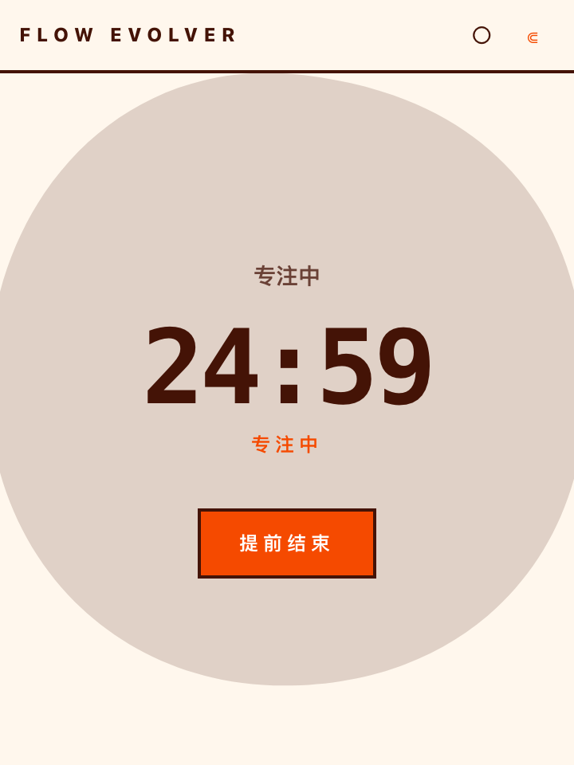
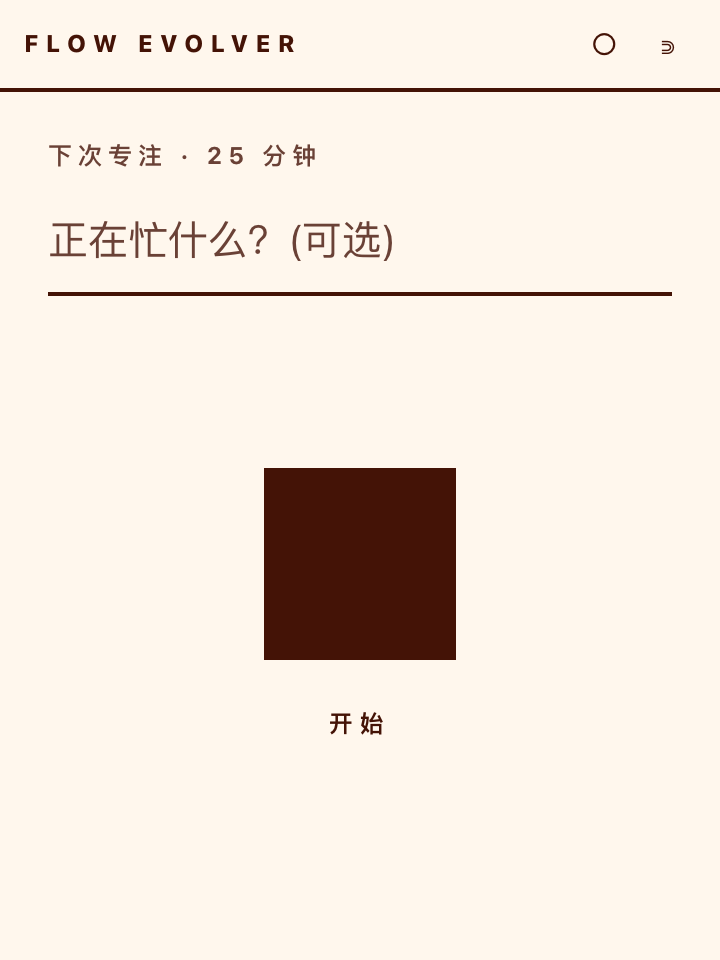
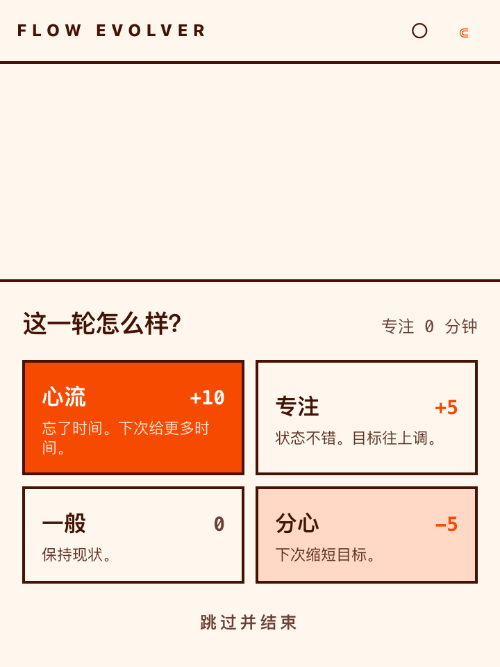

[English](README.md) | **简体中文**

# Flow Evolver

一个**拒绝在你进入心流时打断你**的自适应专注计时器。

经典番茄钟有一个致命缺陷:当你终于进入心流状态时,铃声一响,一切都被打碎。Flow Evolver 反其道而行——当目标时间耗尽时,它**什么都不做**:不响、不弹窗。它只是安静地转成*正计时*(`+01:23 …`),在你的超专注状态上一直保护下去,能撑多久就撑多久。等你决定停下,一键为这一轮打分,而这次打分会把*下一次*的目标悄悄往上或往下调。久而久之,计时器会自己适配你的节奏。

基于 Tauri v2 构建的桌面应用 —— macOS(Apple Silicon + Intel)和 Windows。

---

## 功能特性

- **自动流。** 倒计时归零 → 计时器静默切换为正计时。你继续工作。背景 blob 会随着你超时越久,从平静的棕色缓慢转向躁动的血橙色,让你*感受*到负荷,却不被打断。休息期间 blob 保持平静,直到休息目标耗尽才转为躁动——一个温和的"该回去工作了"提示,而不是又一个逼你的倒计时。
- **四档自我评分(中文界面)。** 停下时选 心流 (+10 分钟)/ 专注 (+5 分钟) / 一般 (0) / 分心 (−5 分钟),clamp 到 10–90 分钟的合理区间。下一次会话就用新目标。
- **按比例休息。** 专注结束后,按你实际专注的时长派生出相应休息(默认每 25 分钟休息 5 分钟)。可跳过。
- **轻量任务标签。** 可选一行标签,记录你在忙什么。不做项目、不做列表——只留上下文。
- **统计。** 今日专注时长、会话次数、连续天数,本地存于 SQLite。
- **小窗 + 展开。** 以 360×480 窗口运行,可置顶;一键展开。不做真正的 OS 全屏(那会隐藏标题栏并占用一个 macOS 空间——对专注小部件来说太重了)。

## 截图







## 一次完整的专注会话

```
待机 idle ──点开始──▶ 专注 focus ──到点(不打断)──▶ 自动流 autoflow
  ▲                                                   │
  │                                                   │ 点"提前结束"
  │                休息 rest ◀──(评分)─── 评分 rating ◀┘
  │                  │
  └──休息结束/跳过────┘
```

1. **待机** — 显示下一目标(如 25 分钟)、任务输入框、开始按钮、底部统计条。
2. **专注** — 倒计时,背景 blob 缓慢蠕动,窗口自动展开。
3. **自动流** — 到点**不响不弹**,静默转正向计时 `+00:01…`,blob 加速变橙。
4. **评分** — 点"提前结束"后快照本轮实际秒数,弹出四档:心流/专注/一般/分心。
5. **休息** — 按实际专注时长按比例派生(默认 5 分钟/25 分钟);不足 1 分钟直接跳过。
6. **回到待机** — 下一目标已被你的自评悄悄调整(±档位,clamp 10–90 分钟)。

每一次状态转换都是纯 `useReducer` action;持久化发生在监听阶段变化的 effect hook 里,所以状态机保持可测。

## 诚实的边界(它*不是*什么)

这是一个聚焦的单用途工具,不是营销稿里的"神经自适应引擎"。具体来说:

- blob 的颜色/morph 速度是时间流逝的**行为代理**,不是对你前额叶代谢的测量。这个 app 读不懂你的大脑状态;它只能让你看到时间在流逝。
- 启发式是一条**简单、可解释的四档规则**,刻意不是一个隐藏的 ML 模型。整个卖点就是:你能看见并推理目标如何移动。
- 没有脑电、没有上下文感知的应用拦截、没有多人模式。这些不在本项目的范围内(动机相关的设计笔记见仓库历史)。

## 设计决策

| 选择 | 为什么 |
|---|---|
| **Tauri**(而非 Electron/web) | 小巧的原生二进制、真正的置顶窗口、本地 SQLite。一个活在桌面上的专注工具。 |
| **基于时间戳的计时** | 已用时间由 `Date.now() - startedAt` 推导,而不是 `setInterval` 累加。窗口挂起/系统休眠也能扛住;自动流正计时只是 `remaining < 0`。 |
| **单窗口,CSS 自适应** | 一棵 React 树,两套布局。`setSize` 切换 小↔展开。比两个窗口简单,blob 过渡保持流畅。 |
| **调整过的 Neo-brutalism** | 只用三种颜色(暖米白、深棕、血橙)、超大等宽数字、无圆角无阴影。为桌面可读性做了恰好的调整。 |
| **`useReducer` 状态机** | `idle → focus → autoflow → rating → rest → idle`。所有转换都是纯函数且经单测;持久化在 effect hook 里,不在 reducer 里。 |

## 图标

App 图标(macOS `.icns` + Windows `.ico` + 全部 PNG 尺寸)由 `src-tauri/icons/source/icon.svg` 生成——一张 neo-brutalist 配色下的手绘 blob 复刻(暖米白底、血橙有机形体、深棕中心内核)。重新生成:

```bash
# 1. 将 SVG 渲染成 1024px 母图(headless Chrome 保持矢量精度)
# 2. sips 缩放进 iconset,iconutil → .icns,sips → .ico
# 母图与 .html 源见 src-tauri/icons/source/
```

## 快速开始

```bash
# 前置:Node 20+、Rust stable、Xcode 命令行工具
npm install

# 开发运行(热重载)
npm run tauri dev

# 测试(逻辑 + 组件)
npm test

# 生产构建 → .app + .dmg
npm run tauri build
```

构建产物:

```
src-tauri/target/release/bundle/macos/flow-evolver.app
src-tauri/target/release/bundle/dmg/flow-evolver_0.1.0_aarch64.dmg
```

## 项目结构

```
src/
  timer/
    engine.ts     # 纯时间计算(时间戳、剩余、疲劳、格式化)
    reducer.ts    # 专注会话状态机
    heuristic.ts  # 四档评分 → 下一目标调整 + 休息派生
  blob.ts         # SVG 路径字典、lerpPath 插值、疲劳→morph 时长与颜色
  db.ts           # SQLite(tauri-plugin-sql)sessions + settings
  window.ts       # 小/展开窗口尺寸、置顶
  components/
    Blob.tsx      # 液态 morph 主形状 + 待机 seed
    Timer.tsx     # 大号倒计时 / 正计时
    Rating.tsx    # 四档评分面板
    Stats.tsx     # 今日 / 次数 / 连续 统计条
  App.tsx         # 编排:状态、tick、持久化、布局
  index.css       # Tailwind v4 + OKLCH neo-brutalism 主题
src-tauri/
  src/lib.rs              # 托管 SQL 插件 + 迁移
  src/migrations/         # 001 sessions、002 settings
  capabilities/           # sql + 核心权限
  tauri.conf.json         # 360×480 窗口配置
```

## 测试

- **`core.test.ts`**(15 个)——引擎数学、静默自动流翻转(证明 `startedAt` 保持不变、已用时间越过目标后继续增长)、reducer 转换 + 守卫(START_FOCUS、RATE、SKIP_RATING)、启发式 clamp、休息派生、四档增量。
- **`App.test.tsx`**(7 个)——app 挂载、从 SQL mock 加载配置、点击开始展开窗口、getStats 连续天数时区(UTC+8 本地午夜用例)、loadConfig 损坏韧性(NaN 兜底、min/max 修复、越界目标 clamp 进 `[min, max]`)。
- **`rating-repro.test.tsx`**(3 个)——复现"专注 0 分钟 不响应"卡死:开始 → 提前结束 → 评分面板 → 点心流 → app 恢复响应;双击评分按钮不会取消已开始的休息;评分面板"专注 X 分钟"标签不会把上一轮的时长泄漏进一个 0 秒的会话。含静态 z-index 契约检查(面板 z-20 > main z-10)——卡死的根因是真实鼠标点击命中了 main 的透明 div。
- **`Blob.test.tsx`**(4 个)——疲劳→时长映射的 morph 步进、疲劳逐 tick 漂移时 blob 仍持续 morph 的回归(旧 `setInterval(dur)` 在 deadline 前被重建导致冻结)、`lerpPath` 液态插值函数(t=0 → from,t=1 → to,骨架保留)。
- **`window.test.ts`**(2 个)——展开模式把显示器物理工作区按缩放因子换算成逻辑单位(一个让 Retina 2x 下"展开"被 clamp 成全屏的 bug),以及小窗口保持固定尺寸。

用 `npm test` 运行。

## 可调参数

默认值在 `src-tauri/src/migrations/002_settings.sql`,持久化在 `settings` 表:

| key | 默认 | 含义 |
|---|---|---|
| `focus_target_seconds` | 1500 (25m) | 下一会话目标,由评分调整 |
| `focus_target_min` / `_max` | 600 / 5400 | clamp 区间(10–90 分钟) |
| `rest_ratio_numerator` / `_denominator` | 5 / 25 | 每专注分钟对应的休息分钟 |

## 许可证

GPL v3 —— 见 [LICENSE](LICENSE)。任何人可查看、修改、使用本代码;衍生作品必须以相同许可证发布。
